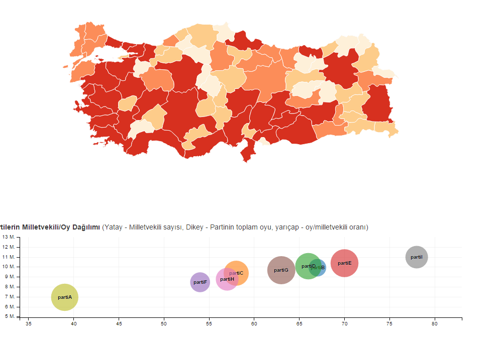

# Türkiye GeoJSON haritası
Şehirlere ayrılmış GeoJSON formatlı dosyayı Türkiye'deki şehirleri listelemek, üzerinde data görselleştirme yapmak veya herhangi interaktif demo için kullanabilirsiniz. İki adet karakter kodlamasından size uygun olanı indiriniz.

İndirme linkleri: **[ANSI](geo/tr-cities-ansi.json)** / **[UTF8](geo/tr-cities-utf8.json)**

## Örnek
Örnek için küçük bir [seçim sonucu sayfası](http://lab.cihadturhan.com/tr-geojson/) yaptım. Şu an henüz seçim olmamış olduğundan veriler *tamamen rastgele* üretilmiştir. Kodlari burda mevcuttur.

## Lisans

Burdaki veriler [Open Street Map](http://www.openstreetmap.org/copyright) ile üretilmiştir. Dolayısıyla [Open Data Commons Open Database](http://opendatacommons.org/licenses/odbl/) kapsamında açık kaynak olarak lisanslanmıştır.

>The Open Database License (ODbL) is a license agreement intended to
allow users to freely share, modify, and use this Database while
maintaining this same freedom for others. Many databases are covered by
copyright, and therefore this document licenses these rights. Some
jurisdictions, mainly in the European Union, have specific rights that
cover databases, and so the ODbL addresses these rights, too. Finally,
the ODbL is also an agreement in contract for users of this Database to
act in certain ways in return for accessing this Database.

>Databases can contain a wide variety of types of content (images,
audiovisual material, and sounds all in the same database, for example),
and so the ODbL only governs the rights over the Database, and not the
contents of the Database individually. Licensors should use the ODbL
together with another license for the contents, if the contents have a
single set of rights that uniformly covers all of the contents. If the
contents have multiple sets of different rights, Licensors should
describe what rights govern what contents together in the individual
record or in some other way that clarifies what rights apply.

>Sometimes the contents of a database, or the database itself, can be
covered by other rights not addressed here (such as private contracts,
trade mark over the name, or privacy rights / data protection rights
over information in the contents), and so you are advised that you may
have to consult other documents or clear other rights before doing
activities not covered by this License.
